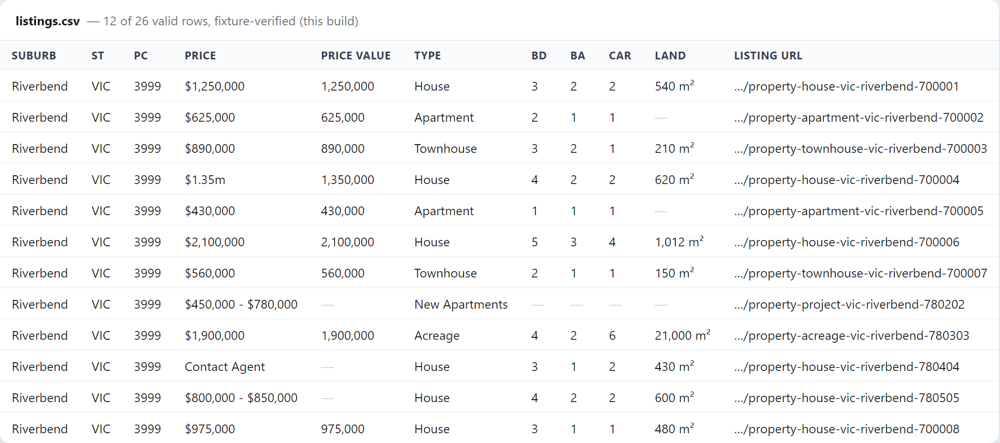

# property-listing-extractor

Export clean listing rows from a bot-protected Australian property portal — for a
client who imports one CSV by hand, no automation and no sync.



## Results

**This build — fixture-verified (synthetic pages, no live run):**

| Measure | Number |
|---|---|
| Parser parity (Python vs JavaScript) | identical rows on every fixture page, asserted row-for-row by `tests/test_parity.py` (runs under Node in CI; skips loudly if Node is absent) |
| Synthetic search pages parsed | 2 pages, 28 listing rows seen |
| Valid after validation | 26 rows, 26 unique `listing_url`, 0 agency cards |
| Dropped (with reason) | 2 — 1 missing `listing_url`, 1 duplicate |
| Test suite | 55 tests with Node (`pytest`); 51 pass + 4 skip without it (the parity cases). `ruff` clean, `check_no_pii` clean |

The 28 → 26 numbers come from `listing-extract --demo`. Denominator: the two
synthetic search fixtures in `tests/fixtures/pages/`.

**Predecessor prototype — live, manual browsing, 2026-08-30 (quoted as such):**

- First pass returned **53 rows**, which exposed two bugs: agency office cards
  counted as listings, and URLs fabricated from the listing id for listings with
  no canonical link — every one of those dead on arrival.
- After the fixes (carried into this build's parser and tests): **26 exported,
  26 unique `listing_url`, 0 agency cards, 0 fabricated URLs.**

The rewritten parser is verified against the structural fixtures and by the
Python/JS parity test. The 2026-08-30 figures above come from the predecessor
prototype, not from this codebase.

**Live re-verification (extension, manual browsing, 2026-09-08):**

- **37 seen** — listing-shaped rows encountered while hand-paging the search
  results.
- **33 exported, 33 unique `listing_url`.** The extension store is keyed by
  `listing_url`, so the export is de-duped by construction and these two counts
  are always equal. The 37 → 33 gap is 4 rows that were seen again on a later
  search page or carried no canonical link; neither kind reaches the export.
- **0 agency cards. 0 fabricated or malformed URLs** — the parser only ever
  emits a canonical link the page's own JSON carried (an absolute URL, or the
  browsed origin joined to the path as given). Anything else leaves
  `listing_url` empty and validation drops the row.
- **4 exported URLs returned 404 when visited at check time** — well-formed
  canonical links among the 33 whose listings were withdrawn between collection
  and checking. This is a separate set from the 37 → 33 gap and is not an
  extraction fault: listings come off the market continuously, so expect a few
  on any live pass.

**Playwright route:** never completed end to end — a non-AU IP gets 429 on the
first request. In this build it is exercised only by a mocked unit test and
`--dry-run`. A live run needs an Australian residential proxy.

## The job this solves

A one-time export of every active listing for a list of suburbs into **one CSV
the client imports by hand**. No automation, no scheduled re-runs, no integration
with the client's website — they upload the file themselves.

## How it works

The portal server-renders its data into a `<script>` that assigns
`window.ArgonautExchange = {…}`. Inside, values are JSON strings stringified one
or more levels deep (a urql GraphQL cache). The page wipes the live variable
after hydration, so the parser reads the script tag's **text**.

One parser, two runtimes:

1. Find the assignment; scan one balanced `{…}` with a string-aware brace
   counter.
2. Walk the object recursively, parsing any string that looks like JSON.
3. Keep every dict that looks like a listing — **requires `address.suburb`**, so
   agency cards do not qualify. Key paths are never hard-coded; they change.
4. Map each to 17 fields. A field the source does not expose stays empty. A
   relative canonical link is absolutised against the page/tab origin at
   runtime (the offline demo leaves it relative).
5. Validate: `listing_url, suburb, state, postcode, price_text, property_type`
   must all be present; dedupe by `listing_url`; every drop is logged with a
   reason.

The Python package (`src/listing_extractor/`) and the extension's `parser.js` are
kept in agreement by `tests/test_parity.py`, which runs both over the same
fixtures and compares the row sets.

## Quick start

Offline, from a fresh clone (needs Python 3.10+):

```bash
pip install -e ".[dev]"
python scripts/generate_fixtures.py
listing-extract --demo
```

Writes `output/listings.csv` and `output/listings.xlsx` and prints a summary
(pages parsed, rows seen, valid rows, dropped rows with reasons). `pytest` runs
the full suite; install Node so `tests/test_parity.py` executes rather than
skips.

## Two routes

- **Extension route** — a person browses; the extension reads the page's own
  embedded JSON and exports CSV / XLSX. This is the delivery route. It ships
  with **no site access**: you click "Grant access to this site" in the popup,
  which asks Chrome for permission to the origin you are on
  (`chrome.permissions.request`), and only then registers its scripts for that
  site. Nothing — no portal name, no origin — is hardcoded in `manifest.json`.
- **Playwright route** — a headless browser pages through search results; needs
  an Australian residential proxy and stops itself after repeated blocks. It
  navigates a base URL you set for that route.

Which to use, and what each cannot do: [`docs/routes.md`](docs/routes.md).
Loading the extension: [`extension/README.md`](extension/README.md).

## Data & privacy

- No real listing rows anywhere — not in fixtures, tests, screenshots or docs.
  Fixtures are synthetic (Faker names, `*.example` domains, an invented suburb)
  but structurally faithful to the real blob.
- Real-estate agents are individuals: `agent_name` and `agency_name` are dropped
  unless `--keep-agent` is passed.
- Screenshots are taken against `scripts/serve_fixtures.py` on localhost, never
  the live site.
- `scripts/check_no_pii.py` scans tracked text files for email / phone / street-
  address patterns and runs in CI.
- The portal's brand name is kept out of the repo. The extension has no
  hardcoded origin — it asks for access to whatever site you are on, when you
  ask it to — and the offline demo keeps canonical links relative rather than
  inventing a host.

## Limitations

- **Automated page loads are blocked from most IPs.** The Playwright route needs
  an Australian residential proxy and has never completed a live run.
- **The extension is paced by a person by design.** It never auto-navigates or
  crawls in the background; volume is limited to what someone can hand-page.
- **A markup change breaks the parser** — the balanced-scan and shape heuristics
  assume the `ArgonautExchange` assignment and a listing-shaped dict. The tests
  catch a break; they do not prevent it.
- **Project listings and hidden-address listings have empty fields on purpose**
  (range price, no single bed/bath; withheld street address). Empty is not a
  bug.
- **Fixture-verified is not live-verified.** Every number above the predecessor
  section is from synthetic pages built to match the real blob's shape.

## Stack

Python 3.10+ (`src/` layout, `openpyxl`, optional `playwright`), a Manifest V3
Chrome extension (vanilla JS, bundled SheetJS), `pytest` + `ruff`, GitHub Actions
running ruff / pytest / `check_no_pii` with Node present for the parity test.

## License

MIT — see [LICENSE](LICENSE).
