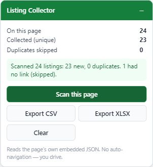
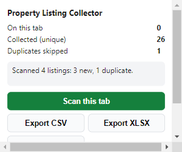

# Extension route (Manifest V3)

A person browses the portal normally; this extension reads the JSON the page
already embedded and collects it into a table you export as CSV or XLSX. No
auto-navigation, no background crawling — you drive.

 

## Load it unpacked

1. Open `chrome://extensions`.
2. Turn on **Developer mode** (top right).
3. Click **Load unpacked** and pick this `extension/` folder.
4. The **Property Listing Collector** icon appears in the toolbar.

## Point it at the real portal

`manifest.json` ships with placeholder match patterns
(`https://www.example-portal.example/*`) so the portal's name is not committed to
this public repo. Before a real run, edit `manifest.json` and replace **both**
occurrences (in `host_permissions` and in `content_scripts[0].matches`, and the
one in `web_accessible_resources`) with the real portal origin, then reload the
extension on `chrome://extensions`.

## Use it

- Browse to a search-results page on the portal.
- The **Listing Collector** panel appears (drag it by its header; the toolbar
  popup does the same job).
- Click **Scan this page**. The panel shows listings found on the page, the
  running unique total, and duplicates skipped.
- Page through the results yourself, clicking **Scan this page** on each.
- Click **Export CSV** or **Export XLSX** when done. Files download via the
  background worker.
- **Clear** empties the collected set (`chrome.storage.local`).

## How the pieces fit

| File | Role |
|---|---|
| `parser.js` | the single parser — finds `window.ArgonautExchange` in the script **text** (the page wipes the live variable), scans one balanced object, un-stringifies nested JSON, keeps dicts that look like a listing, maps them to the 17-field row. Same file the parity test runs under Node. |
| `storage.js` | the collected set in `chrome.storage.local`, deduped by `listing_url`. |
| `panel.js` / `panel.css` | the draggable in-page panel: stats, a status line, and four keyboard-accessible buttons. |
| `content.js` | wires the panel to the parser and the store; builds the CSV; asks the background worker to download. |
| `popup.js` / `popup.html` | the toolbar popup — runs `parser.js` in the active tab via `chrome.scripting.executeScript`, into the same store. |
| `background.js` | the service worker: builds the XLSX with bundled SheetJS (`vendor/xlsx.full.min.js` — MV3's CSP forbids a CDN script) and is the only context that calls `chrome.downloads`. |

## Why a person has to drive

Automated page loads from most IPs are blocked on the first request. A real
browser driven by a person is not — so the extension never navigates for you and
never crawls in the background. For volume beyond what hand-paging can cover, see
[`../docs/routes.md`](../docs/routes.md).
